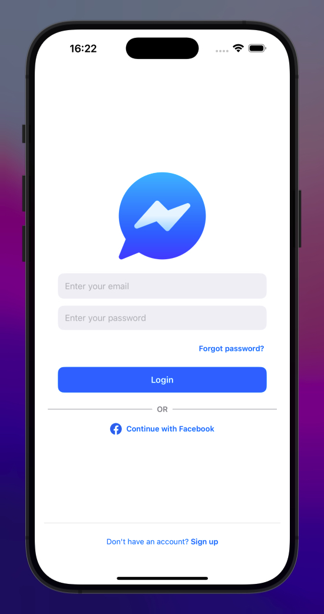
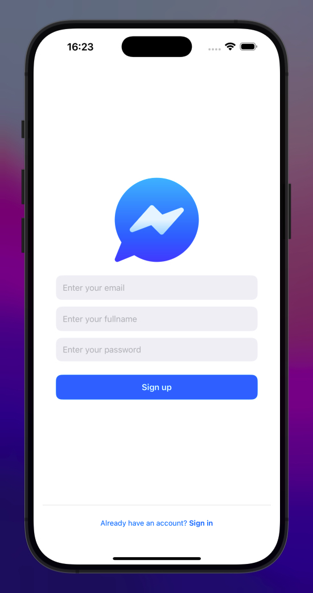
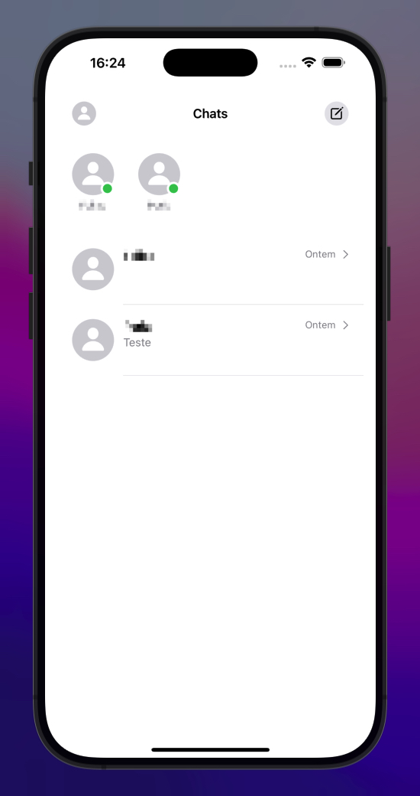
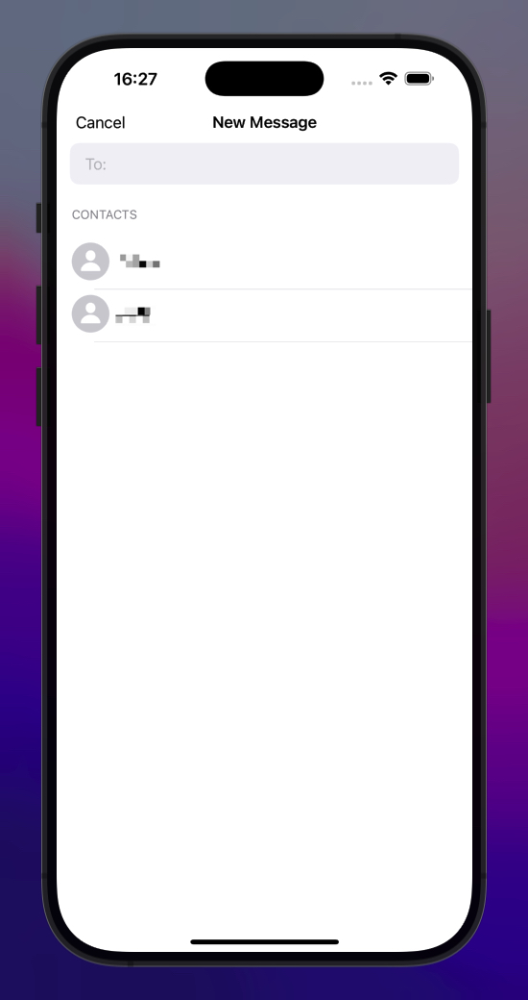
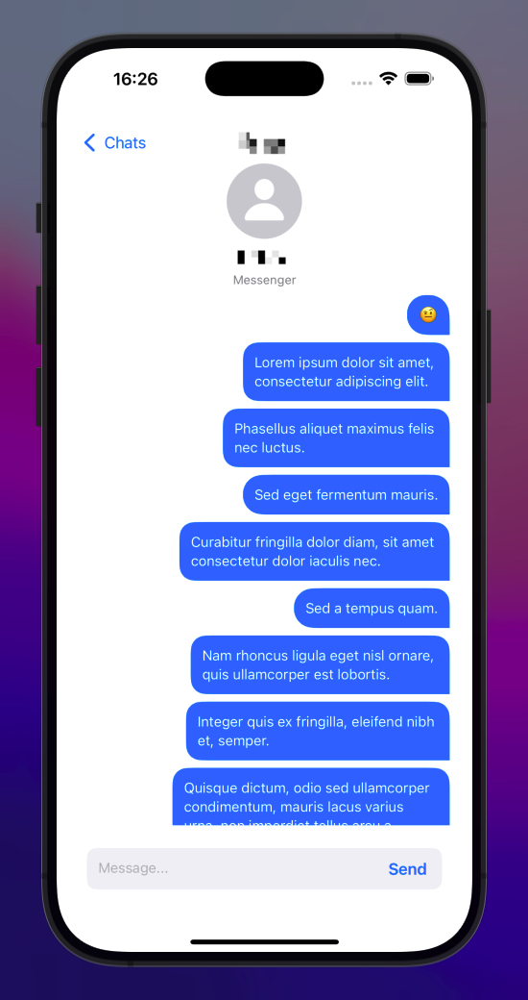

# Messenger 

## Link do Curso

- [AppStuff](https://youtube.com/playlist?list=PLRcTS2CSnBfM-VDeDGajFwq6K-yfplXlC&si=OndxvFvHQlCKr6E1)

## Feito por:

- [Luiz Gustavo Bragança dos Santos](https://github.com/Luizgustavo358)

## O que a aplicação faz:

A aplicação de chat entre usuários.

## Descrição das Telas
| Cadastro              | Criar Usuário         | Chats              |
|-----------------------|-----------------------|--------------------|
|     |  |  |

| Nova Mensagem           | Inbox              | Perfil               |
|-------------------------|--------------------|----------------------|
|  |  |  |

---

## O que eu usei:

- Aplicativo feito em:
  - [Xcode](https://developer.apple.com/xcode/)
- Linguagem de programação:
  - [Swift](https://www.apple.com/br/swift/)
- Banco de dados:
  - [Firebase](https://firebase.google.com/)